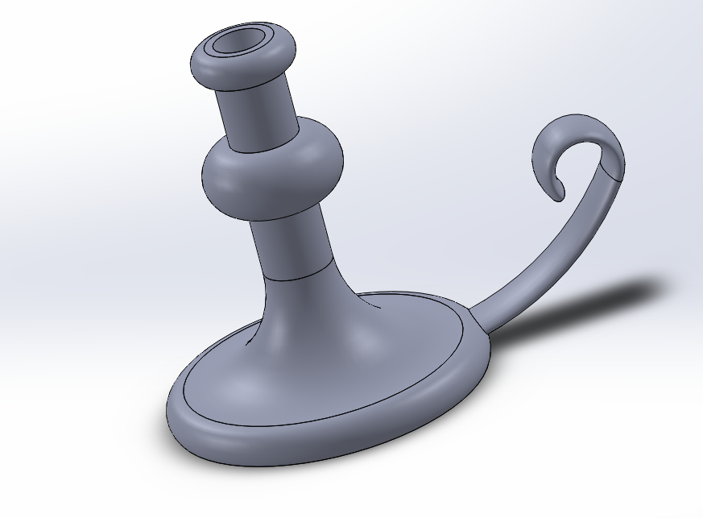
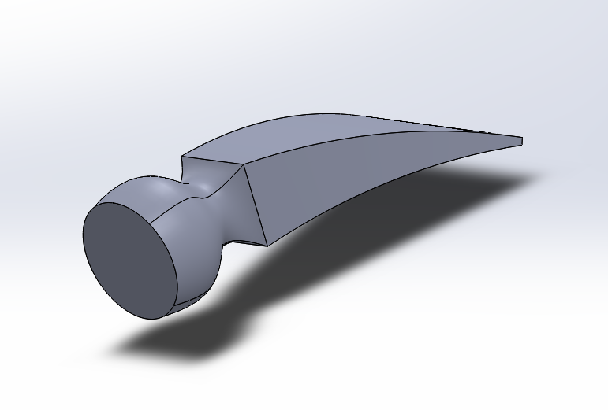
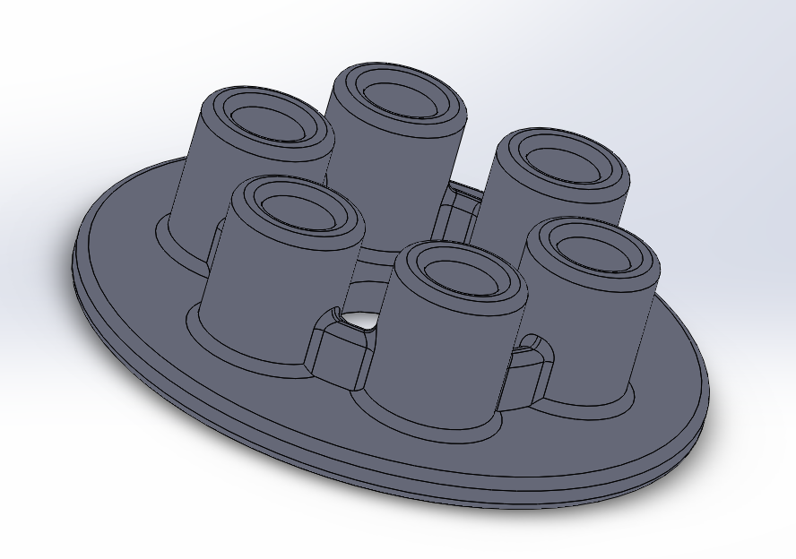
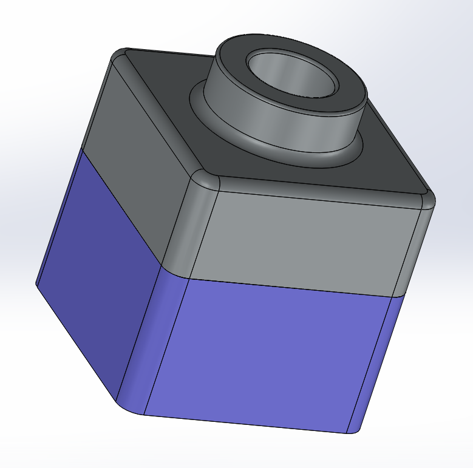

# Not-So-Basic-CAD

## Sweeps and Lofts
#### Included Files:
<a href="Cstick.SLDPRT">Cstick.SLDPRT</a>  
<a href="Loft_Tutorial.SLDPRT">Loft_Tutorial.SLDPRT</a> 

This assignment was the Solidworks tutorials Revolves and Sweeps, and Lofts. In them I made a candlestick and a hammer head using new tools.
  
 
  
The most challenging part of this assignment was the flex feature in the hammer head because the pictures in the tutorial were a tad confusing.
## A Little Practice
#### Included Files:
<a href="Pressure_Plate.SLDPRT">Pressure_Plate.SLDPRT</a> 
<a href="Tutor1.SLDPRT">Tutor1.SLDPRT</a> 
<a href="Tutor2.SLDPRT">Tutor2.SLDPRT</a> 
<a href="tutor.SLDASM">tutor.SLDASM</a> 

This assignment was the Solidworks tutorials Introduction to Solidworks, Lesson 1: Parts, Lesson 2: Assemblies, in which I made a pressure plate and an assembly of a block.
 
 
 
I didn't find this assignment very difficult, as it was mostly a review of things I already knew.
